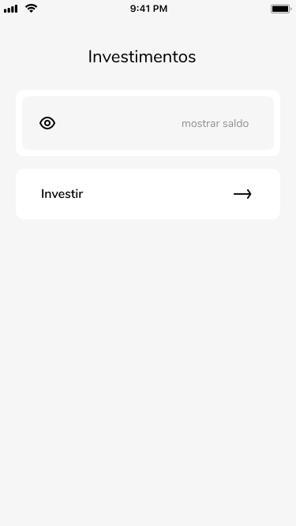
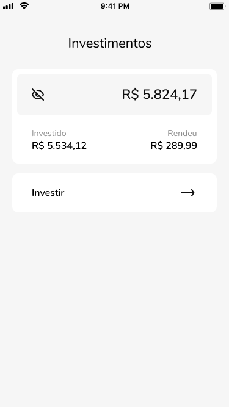
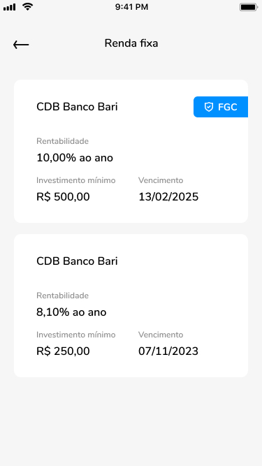
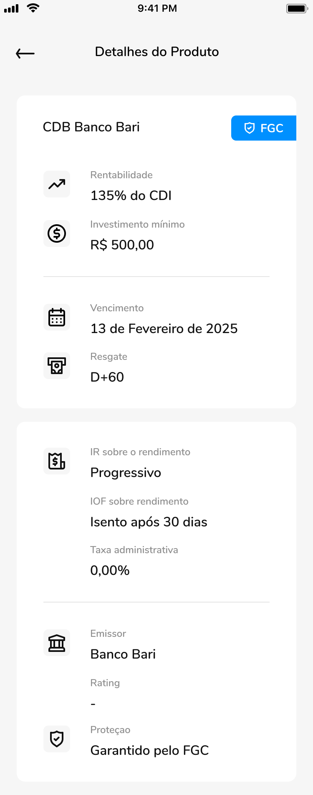

## Teste prático para desenvolvedor iOS

### Sobre nós

O Banco Bari .…

### Objetivo

Desenvolver um aplicativo mobile nativo para iOS utilizando Swift 5.+ para iOS 12.1+  simulando o início do fluxo de investimentos de nosso aplicativo, este fluxo consistem em:

**Importante:**

Todas os valores monetários estão em inteiros de centavos, ou seja, para a apresentação é necessário realizar a conversão.

O prótipo do figma pode ser acessado [aqui](http://tiny.cc/8i59rz)  nele é possível navegar entre as telas e visualizar o comportamento esperado para cada tela.

#### Dashboard 1.1:
   * Regras:
       * Consultar saldo utilizando a URL ..…
       * Ao selecionar a área cinza com o ícone de olho e o texto "mostrar saldo", deve-se exibir o saldo como na tela [Dashboard 1.2](#dashboard-1.2)
       * Ao pressionar o botão "Investir", deve-se ir para a tela: [Listagem](#listagem-de-papeis)
   * Protótipo

#### Dashboard 1.2
   * Regras:
       * Ao selecionar novamente a área cinza onde o ícone do olho fechado está presente, deve-se retornar ao estado anterior da tela.  [Dashboard 1.1](#dashboard-1.1)
   * Protótipo

#### Listagem De Papéis

* Regras:
     * Consultar a lista de papéis disponíveis utilizando a URL ..…
     * A tag FGC somente deverá ser apresentada para papéis com a flag "fgc" ativa.
     * Ao selecionar um papel, deverá se apresentar os detalhes deste papel [Detalhes.](#detalhes)
   * Protótipo

#### Detalhes

* Regras:
     * Consultar o detalhe do papel utilizando a URL ..…
     * A tag FGC somente deverá ser apresentada para papéis com a flag "fgc" ativa.
   * Protótipo

### Esperado

* Uso de uma arquitetura de sua preferência (MVC, MVVM, Clean, VIPER, etc)
* Controle de versão
* Design Patterns
* Orientação a objetos
* Clean Code
* Boas práticas de programação

### Diferenciais

* Testes unitários 
* Documentação da camada de rede
* View-Code
* Uso mínimo de bibliotecas open-source
* Algo que demonstre o que está ocorrendo com a camada de rede, para facilitar a depuração da aplicação (ex: Logger)
* Fastlane
* CI/CD - Github Actions

### O que iremos avaliar

* Correta aplicação da arquitetura escolhida;
* Projeto funcionando;
* Organização / legibilidade do código;
* Padronização dos commits;
* Domínio da linguagem e do sistema operacional;

### O que não gostaríamos:
* Descobrir que seu código foi feito por outra pessoa;
* Commits muito grandes;

### Entrega

O código deve estar disponível em um repositório privado no __ , deve ser liberado acesso ao grupo: __ e enviado um e-mail com o link do repositório para __ com uma breve descrição da arquitetura e os motivos que o levaram a escolhê-la.
